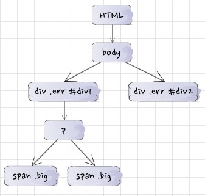
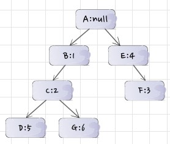
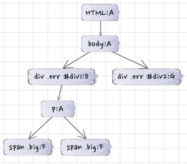

# 浏览器样式计算

> 本文是对这篇文章的学习笔记：https://www.html5rocks.com/en/tutorials/internals/howbrowserswork/

## 规则树的生成

全篇以下面这段 html 和 css 为例。

``` html
<html>
  <body>
    <div class="err" id="div1">
      <p>
        <span class="big"> big error 1</span>
        <span class="big"> big error 2</span>
      </p>
    </div>
    <div class="err" id="div2">another error</div>
  </body>
</html>
```

``` css
1    div {margin:5px;color:black}
2    .err {color:red}
3    .big {margin-top:3px}
4    div span {margin-bottom:4px}
5    #div1 {color:blue}
6    #div2 {color:green}
```

### 浏览器的样式计算过程描述

1. 解析 HTML code 得到 DOM 树



2. 遍历 DOM 树节点，得到规则树



现在，你一定是懵的。这个树是怎么生成的？它代表什么意思？往下看。

生成过程如下：

  - a. 遍历 dom 树，首先拿到 html 节点，用 html 节点去匹配样式表，发现 html 这个 dom 节点没有匹配到任何样式规则，则得到一个匹配路径 A，路径节点样式是 null（匹配路径是什么？继续看）；

  - b. 继续遍历，拿到 body 节点，用 body 节点去匹配样式表，发现 body 这个 dom 节点也没有匹配到任何样式规则，则得到同一个匹配路径 A，路径节点样式是 null；

  - c. 继续遍历，拿到 div.err#div1 节点，用这个节点去匹配样式表，发现 3 个与之匹配的样式规则（1, 2, 5）。那么，div.err#div 这个 dom 节点的样式一定是这 1, 2, 5 这 3 条规则的组合，怎么组合呢？答案是按照优先级层叠起来，类似 javascript 中的原型继承概念。5 的优先级最高（id选择器），其次是 2（类选择器优先级低于id选择器），最后是 1，那么就的到一个“原型链”：5 - 2 - 1。为了方便后续使用，我们将它记作匹配路径：B(1) - C(2) - D(5)。 将它们按照路径顺序添加到跟节点 A 的下面构成树状结构。

  - d. 以此类推。自己试试剩下的节点匹配过程。

3. 在这个过程中，得到最终的样式上下文树



观察样式上下文树，其实就是将每个 DOM 节点和它对应的样式匹配路径的端点对应起来。这样，对于这颗树上的每个节点（比如第一个 span.big），就能得到匹配路径的端点（比如 D），然后在规则树中找到 D 节点，并向上追溯到跟节点（A），就能得到最后的样式层叠 D - C - B - A，即样式 5 - 2 - 1 - null 的层叠结果。


### 问题

1. 在生成规则树的时候，对于任意 DOM 节点，要遍历整个规则。那么渲染引擎是怎么优化的？

2. 在生成规则树的时候，对于一个确定的规则集合（比如 1 , 2 , 5），渲染引擎是怎么决定先后顺序的？

## 浏览器的匹配过程（回答问题1）

以最右边的选择器为准，对规则列表进行分类，并归类到以下表格中。

### 类表：
``` javascript
{
 ".err" : 2, 
 ".big" : 3
}
```

### id 表：
``` javascript
{
 "#div1" : 5,
 "#div2" : 6
}
```

### 标记表：
``` javascript
{
  "div" : 1,
  "span" : 4
}
```

例子：

``` html
<div class="err" id="div1">
```

因为存在 class 值 err，所以在类表中找到键 ".err"，从而找到规则 2
因为存在 id 值 div1，所以在 id 表中找到键 "#div1"，从而找到规则 5
因为存在 tag 名 div，所以在标记表中找到键 "div"，从而找到规则 1

最终规则是 1, 2, 5


## 浏览器的样式层叠规则（回答问题2）

通过计算一个值：abcd

对于任意一条样式规则

1. 如果来自于“style”属性，a=1，否则为 a=0
2. b = id选择器的个数
3. c = 其他属性和伪类的个数
4. d = 元素名称和伪元素个数

举例：

``` css
1    div {margin:5px;color:black}
2    .err {color:red}
3    .big {margin-top:3px}
4    div span {margin-bottom:4px}
5    #div1 {color:blue}
6    #div2 {color:green}
```

 1 的 abcd 值为：0001
 
 2 和 3 的 abcd 值为：0010

 4 的 abcd 值为：0002

 5 和 6 的 abcd 值为：0100

按照十进制数比较， 100 > 10 > 2 > 1

从而得到规则排序。

你可能会考虑，10 个标签和 1 个 class 的选择器的优先级怎么计算？参见：http://www.zhangxinxu.com/wordpress/2012/08/256-class-selector-beat-id-selector/


